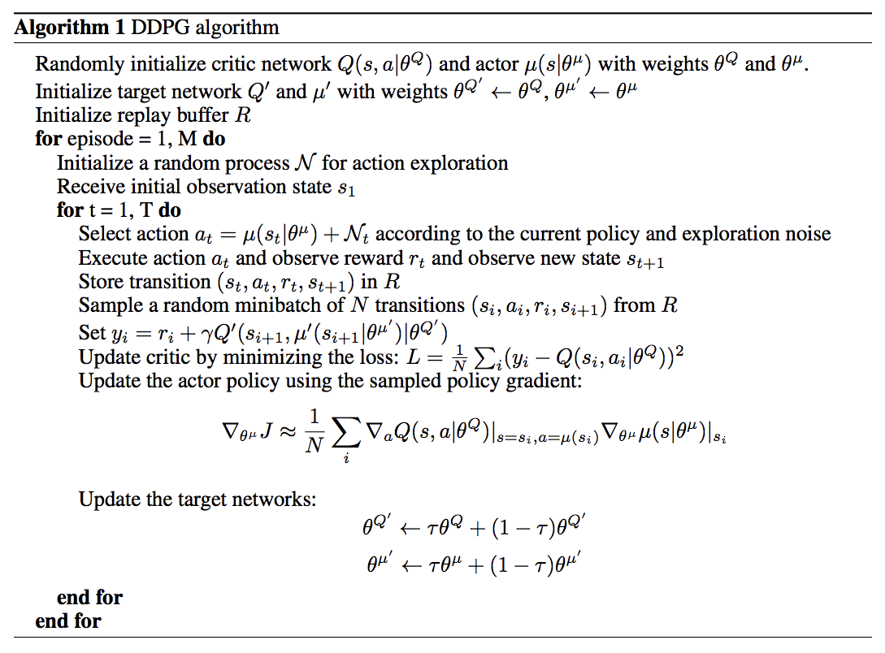
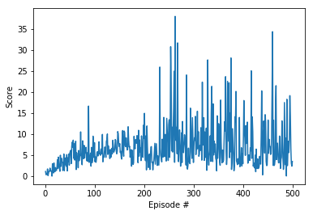
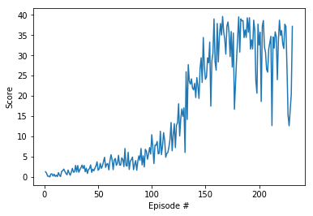

## Report

### Learning Algorithim

 The code used in this project was repurposed from code provided in Udacity projects like the pendelum project.  The algorithim comes from this [paper](https://arxiv.org/pdf/1509.02971.pdf) and is described via pseudo code in the image below:

### Model Archetecture

Initially I brought in code from the pendelum project but the agent was unable to solve the environment within 500 episodes. After a few attempts, I found a solution on the student hub - using batch normalization. 

I. *Initial model* archetecture used 3 layers for the Actor:

        self.fc1 = nn.Linear(state_size, fc1_units)
        self.fc2 = nn.Linear(fc1_units, fc2_units)
        self.fc3 = nn.Linear(fc2_units, action_size)
        
        x = F.relu(self.fc1(state))
        x = F.relu(self.fc2(x))
        return F.tanh(self.fc3(x))
        
and in the Critic:

        self.fcs1 = nn.Linear(state_size, fcs1_units)
        self.fc2 = nn.Linear(fcs1_units+action_size, fc2_units)
        self.fc3 = nn.Linear(fc2_units, 1)
        
        xs = F.relu(self.fcs1(state))
        x = torch.cat((xs, action), dim=1)
        x = F.relu(self.fc2(x))
        
II. *Second model* added batch normalization.  Actor:

        self.fc1 = nn.Linear(state_size, fc1_units)
        self.fc2 = nn.Linear(fc1_units, fc2_units)
        self.fc3 = nn.Linear(fc2_units, action_size)
        self.b1 = nn.BatchNorm1d(fc1_units)
        
        x = F.relu(self.fc1(state))
        x = self.b1(x)
        x = F.relu(self.fc2(x))
        return F.tanh(self.fc3(x))

Critic:
        
        self.seed = torch.manual_seed(seed)
        self.fcs1 = nn.Linear(state_size, fcs1_units)
        self.fc2 = nn.Linear(fcs1_units+action_size, fc2_units)
        self.fc3 = nn.Linear(fc2_units, 1)
        self.b1 = nn.BatchNorm1d(fcs1_units)
        
        xs = F.relu(self.fcs1(state))
        xs = self.b1(xs)
        x = torch.cat((xs, action), dim=1)
        x = F.relu(self.fc2(x))
        return self.fc3(x)
        
### Hyperparameters

        BUFFER_SIZE = int(1e5)  # replay buffer size
        BATCH_SIZE = 128        # minibatch size
        GAMMA = 0.99            # discount factor
        TAU = 1e-3              # for soft update of target parameters
        LR_ACTOR = 2e-4         # learning rate of the actor 
        LR_CRITIC = 2e-4        # learning rate of the critic
        WEIGHT_DECAY = 0        # L2 weight decay

### Results

Set maximum episode to 500.  

I.  Initial Model, fc1_units = 400, fc2_units = 300, fcs1_units=400, fc2_units=300.  Did not achieve an average score of 30:

II.  Initial Model, fc1_units = 128, fc2_units = 128, fcs1_units=128, fc2_units=128.  Did not acheive an average score of 30:

        Episode 100	Average Score: 2.67
        Episode 200	Average Score: 15.42
        Episode 300	Average Score: 22.28
        Episode 346	Average Score: 18.42

III.  Second Model, fc1_units = 128, fc2_units = 128, fcs1_units=128, fc2_units=128, with Batch Normalization.  Solved:
        
        Episode 100	Average Score: 2.74
        Episode 200	Average Score: 23.88
        Episode 231	Average Score: 30.19Environment Solved!
        

Batch Normalization was the key change here that got the network to converge on a solution to the environment.
        
### Future Work

Test different Agents like PPO, A3C or D4PG with the second Version of the Reacher environment.
